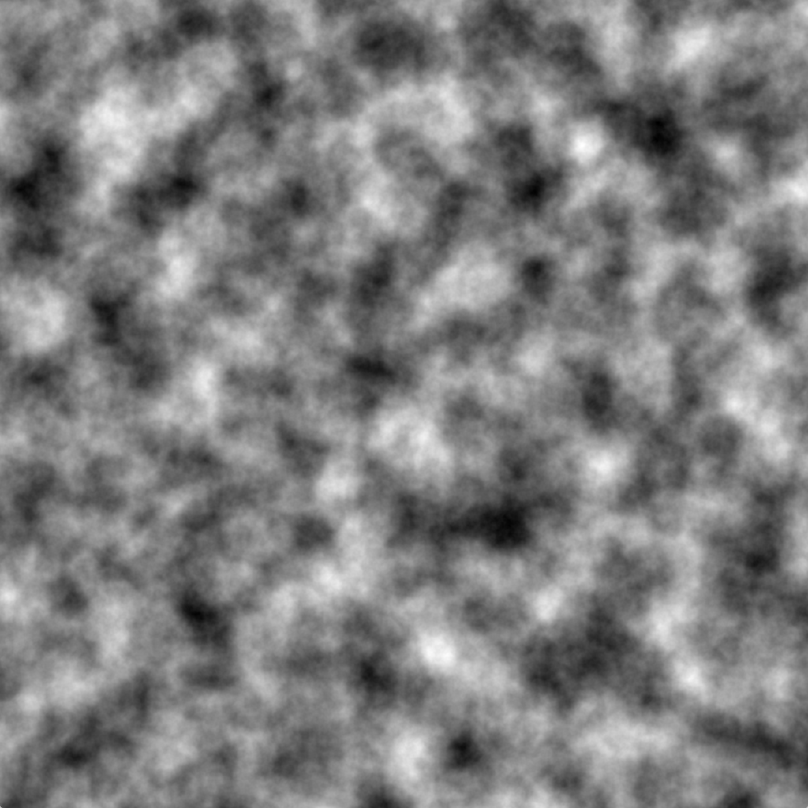
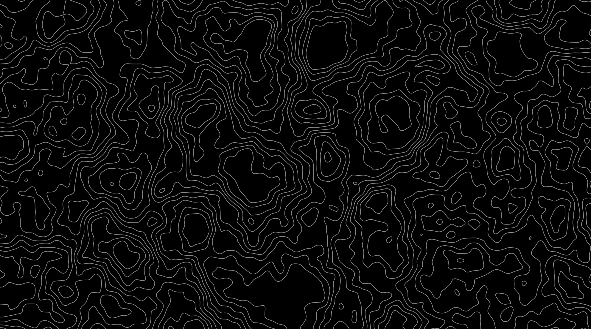

# Perlin Noise Wallpaper Fingerprint


Generate **unique, procedurally-generated wallpapers** using Perlin noise, with your system's CPU utilization as a fingerprint for one-of-a-kind designs. Perfect for developers, designers, or anyone who loves procedural art!

---

## 🌟 About Me and This Project

I've always loved **topographic wallpapers** as the lines are so hypnotizing and so cxool that I've always had a thing for those types of wallpapers. As I’m working on an **upcoming game**, I wanted to design an algorithm that could generate similar procedural art for in-game environments. This project is my way of experimenting with Perlin noise and creating something beautiful along the way.

---

## 🌄 What is Perlin Noise?

Perlin noise is a type of gradient noise developed by Ken Perlin, widely used in computer graphics to generate natural-looking textures, terrains, and patterns. Unlike random noise, Perlin noise is smooth and continuous, making it ideal for creating organic, flowing designs.

Here’s an example of what Perlin noise looks like:



In this project, Perlin noise is used to generate a base pattern, which is then enhanced with contour lines to create stunning wallpapers. Each wallpaper is uniquely tied to your system's CPU utilization, ensuring no two designs are ever the same (so cool right? I find it *"unique"* and interesting).

---

## 🛠️ Libraries Used

This project leverages the following Python libraries:

- **[`noise`](https://pypi.org/project/noise/)**: For generating Perlin noise.
- **[`numpy`](https://numpy.org/)**: For handling arrays and mathematical operations.
- **[`matplotlib`](https://matplotlib.org/)**: For creating and saving the wallpaper as an image.
- **[`psutil`](https://psutil.readthedocs.io/)**: For measuring CPU utilization, which acts as a unique seed.

---

## 🚀 How It Works

1. **CPU Utilization as a Seed**:  
   The program measures your system's CPU utilization using `psutil`. This value is used as a seed for generating Perlin noise, ensuring each wallpaper is unique.

2. **Perlin Noise Generation**:  
   Using the `noise` library, a 2D Perlin noise map is created based on the CPU seed. Parameters like `scale`, `octaves`, `persistence`, and `lacunarity` control the appearance of the noise.

3. **Contour Lines**:  
   The noise map is normalized and passed to `matplotlib`, where contour lines are drawn to create a visually appealing design.

4. **Save as Wallpaper**:  
   The final design is saved as a high-resolution PNG file, ready to be used as your wallpaper.

---

## 🎨 Customization

You can tweak the following parameters to create your perfect wallpaper:

- **Resolution**: Adjust the `width` and `height` variables.
- **Colors**: Use hex codes to customize the contour lines and background.
- **Noise Parameters**: Modify `scale`, `octaves`, `persistence`, and `lacunarity` for different effects.

---

## 🛠️ Installation

### Using `requirements.txt`

1. Clone the repository:
   ```bash
   git clone https://github.com/ravier1/perlin-noise-wallpaper-fingerprint.git

2. Navigate to the project directory:
    ```bash
    cd perlin-noise-wallpaper-fingerprint

3. Install dependencies from requirements.txt:
    ```bash
    pip install -r requirements.txt

4. Run the script:
    ```bash
    python generate_wallpaper.py

# 📸 Example Output

### Here’s an example of a wallpaper generated by this project:



# 🤝 Contributing

Contributions are welcome! Feel free to open issues or submit pull requests to improve the project.

# 📜 License

This project is licensed under the MIT License. See the LICENSE file for details.

# Made with ❤️ by Ravi.
⭐️ Star this repo if you find it cool! ⭐️

  